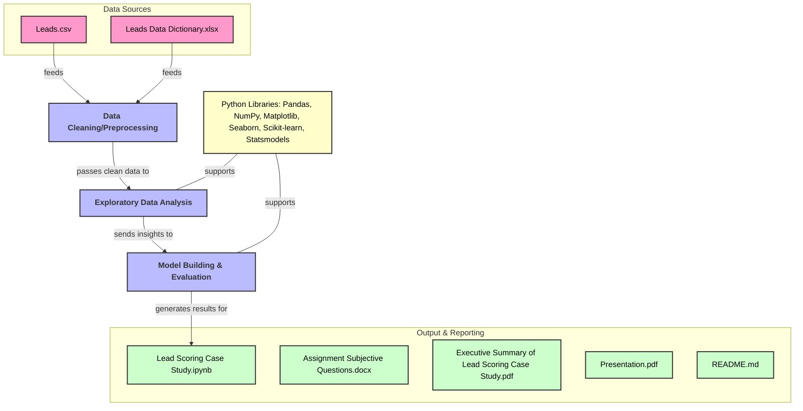

```mermaid
flowchart TD
    subgraph "Data Sources"
        DS1["Leads.csv"]:::data
        DS2["Leads Data Dictionary.xlsx"]:::data
    end

    DS1 -->|"feeds"| P1["Data Cleaning/Preprocessing"]:::process
    DS2 -->|"feeds"| P1

    P1 -->|"passes clean data to"| P2["Exploratory Data Analysis"]:::process

    P2 -->|"sends insights to"| P3["Model Building & Evaluation"]:::process

    subgraph "Output & Reporting"
        R1["Lead Scoring Case Study.ipynb"]:::report
        R2["Assignment Subjective Questions.docx"]:::report
        R3["Executive Summary of Lead Scoring Case Study.pdf"]:::report
        R4["Presentation.pdf"]:::report
        R5["README.md"]:::report
    end

    P3 -->|"generates results for"| R1

    PL["Python Libraries: Pandas, NumPy, Matplotlib, Seaborn, Scikit-learn, Statsmodels"]:::lib
    PL ---|"supports"| P2
    PL ---|"supports"| P3

    click DS1 "https://github.com/geethasagarb/lead_scoring_case_study/blob/master/Leads.csv"
    click DS2 "https://github.com/geethasagarb/lead_scoring_case_study/blob/master/Leads%20Data%20Dictionary.xlsx"
    click P1 "https://github.com/geethasagarb/lead_scoring_case_study/blob/master/Lead%20Scoring%20Case%20Study.ipynb"
    click P2 "https://github.com/geethasagarb/lead_scoring_case_study/blob/master/Lead%20Scoring%20Case%20Study.ipynb"
    click P3 "https://github.com/geethasagarb/lead_scoring_case_study/blob/master/Lead%20Scoring%20Case%20Study.ipynb"
    click R1 "https://github.com/geethasagarb/lead_scoring_case_study/blob/master/Lead%20Scoring%20Case%20Study.ipynb"
    click R2 "https://github.com/geethasagarb/lead_scoring_case_study/blob/master/Assignment%20Subjective%20Questions.docx"
    click R3 "https://github.com/geethasagarb/lead_scoring_case_study/blob/master/Executive%20Summary%20of%20Lead%20Scoring%20Case%20Study.pdf"
    click R4 "https://github.com/geethasagarb/lead_scoring_case_study/blob/master/Presentation.pdf"
    click R5 "https://github.com/geethasagarb/lead_scoring_case_study/blob/master/README.md"

    classDef data fill:#f9c,stroke:#333,stroke-width:2px,color:#000;
    classDef process fill:#bbf,stroke:#333,stroke-width:2px,font-weight:bold;
    classDef report fill:#cfc,stroke:#333,stroke-width:2px,color:#000;
    classDef lib fill:#ffc,stroke:#333,stroke-width:2px,color:#000;
```
