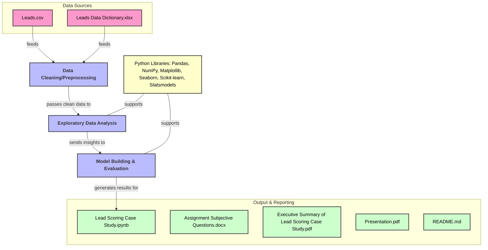

# Lead Scoring Case Study

This repository contains a case study focused on lead scoring using machine learning techniques. The goal is to predict the likelihood of leads converting into customers based on historical data.


## Problem Statement
Businesses often receive numerous leads, but not all of them convert into customers. Efficiently categorizing these leads based on their likelihood to convert helps in prioritizing follow-ups and optimizing marketing efforts. This project aims to develop a predictive model that scores leads to identify the most promising ones.


## Dataset
The dataset `Leads.csv` contains various attributes of leads such as:
- **Prospect ID**
- **Lead Number**
- **Lead Origin**
- **Lead Source**
- **Do Not Email**
- **Do Not Call**
- **Converted**
- **Total Visits**
- **Total Time Spent on Website**
- **Page Views Per Visit**
- **Last Activity**
- **Country**
- **Specialization**
- **Current Occupation**
- **Tags**, etc.

## Libraries Used
- **Pandas**: Data manipulation
- **NumPy**: Numerical computations
- **Matplotlib**, **Seaborn**: Data visualization
- **Scikit-learn**: Machine learning
- **Statsmodels**: Statistical modeling

## Exploratory Data Analysis
- Load the dataset and inspect basic statistics.
- Check for duplicate values in key columns (`Prospect ID` and `Lead Number`).
- Display the first few rows and overall shape of the dataset.
- Generate descriptive statistics and data types information.

## Data Cleaning
- Replace 'Select' values with NaN to handle unanswered questions.
- Drop columns with more than 40% missing values to ensure data quality.
- Handle remaining missing values appropriately.

## Model Building
1. **Data Splitting**: Split the data into training and testing sets.
2. **Feature Scaling**: Standardize numerical features.
3. **Model Selection**: Use algorithms like Logistic Regression.
4. **Evaluation**: Assess models using metrics like Confusion Matrix, Precision, Recall, and F1 Score.

## Results
### Training Dataset
- **Accuracy**: 80.57%
- **Sensitivity**: 79.72%
- **Specificity**: 81.08%

### Test Dataset
- **Accuracy**: 80.34%
- **Sensitivity**: 79.27%
- **Specificity**: 81.04%

## Conclusion
The model demonstrates strong performance in predicting lead conversions with accuracy, sensitivity, and specificity above 80% for both training and test datasets. Key factors influencing higher conversion rates include:
- Using the 'Lead Add Form'
- Being a 'Working Professional'
- Spending more time on the website
- Referral leads from existing customers
- Channels like Google and Direct Traffic
- Engagement through 'SMS Sent' or 'Email Opened'

The most common specialization categories are 'Others', followed by Finance Management, HR Management, and Marketing Management.

## How to Use
1. **Clone the Repository**:
   ```bash
   git clone https://github.com/geethasagarb/lead_scoring_case_study.git
   cd lead_scoring_case_study
   ```

2. **Install Required Libraries**:
   Make sure you have the required libraries installed. You can install them using:
   ```bash
   pip install -r requirements.txt
   ```

3. **Run the Jupyter Notebook**:
   Open the Jupyter Notebook to explore and run the analysis:
   ```bash
   jupyter notebook Lead\ Scoring\ Case\ Study.ipynb
   ```

## References
- [Scikit-learn Documentation](https://scikit-learn.org/stable/)
- [Pandas Documentation](https://pandas.pydata.org/)
- [Matplotlib Documentation](https://matplotlib.org/)
- [Seaborn Documentation](https://seaborn.pydata.org/)
- [Statsmodels Documentation](https://www.statsmodels.org/stable/index.html)

---

